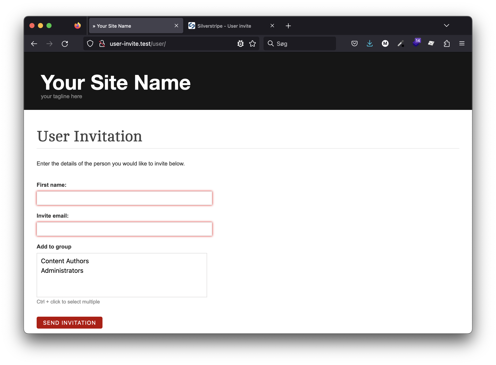
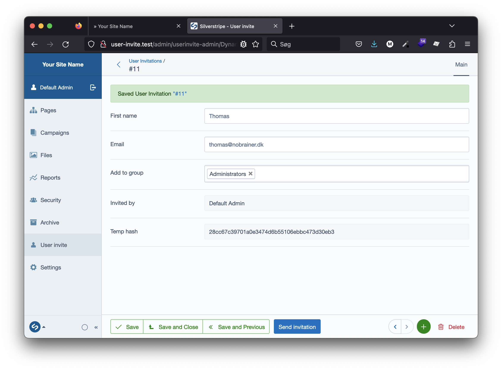

# SilverStripe User Invitation

This module adds the ability to invite users to a secure website (e.g. Intranet or Extranet).

[](https://github.com/dynamic/silverstripe-user-invitation/actions/workflows/ci.yml)
[](https://github.com/sponsors/dynamic)

[](https://packagist.org/packages/dynamic/silverstripe-user-invitation)
[](https://packagist.org/packages/dynamic/silverstripe-user-invitation)
[](https://packagist.org/packages/dynamic/silverstripe-user-invitation)
[](https://packagist.org/packages/dynamic/silverstripe-user-invitation)

## Requirements

* PHP ^8.3
* SilverStripe ^6.0
* [lekoala/silverstripe-cms-actions](https://github.com/lekoala/silverstripe-cms-actions) ^2.0

## Installation

```bash
composer require dynamic/silverstripe-user-invitation
```

## Features

* **Quick-entry invitation form** - By default only first name and email fields are required to invite someone
* **Email invitations** - Sends email invitations to recipients
* **User group assignment** - Supports optional user group assignment (can be made required via configuration)
* **Invitation expiry** - Invitation expiry can be set via configuration
* **Member validation** - Default SilverStripe member validation is applied
* **CMS interface** - Create and send invites from CMS admin interface or frontend form

## Usage

This module enables you to invite users to register on your site. Users can be invited from either:

### Frontend Form


### CMS Admin Interface


## Configuration

### Email Configuration

Set an admin email address (used as sender) in your `app/_config/email.yml` file:

```yml
SilverStripe\Control\Email\Email:
  admin_email:
    mail@example.com: 'Admin at example.com'
```

For easy email testing, use: https://mailcatcher.me/

### Force Required User Group Assignment

To require group selection when inviting users, add the following to your configuration:

```yml
Dynamic\SilverStripe\UserInvitations\Model\UserInvitation:
  force_require_group: true
```

### Template Override

To update the base template, use `updateMainTemplates`. It defaults to `Page`.

```php
/**
 * @param array $mainTemplates
 */
public function updateMainTemplates(&$mainTemplates)
{
    array_unshift($mainTemplates, 'InvitationPage');
}
```

### Redirect After Successful User Creation

Set a custom 'BackURL' to redirect users after completing signup from invitation:

```yml
Dynamic\SilverStripe\UserInvitations\Control\UserController:
  back_url: '/admin/'
```

## License

See [License](LICENSE.md)

## Upgrading from 1.x to 2.x

Version 2.0 is compatible with SilverStripe 6. Key changes:

- **PHP 8.3+** required
- **SilverStripe CMS 6** required
- Updated dependency: `lekoala/silverstripe-cms-actions` ^2.0
- Validation classes moved to new namespaces
- Form validation API updated

Please review the [SilverStripe 6 upgrade guide](https://docs.silverstripe.org/en/6/changelogs/6.0.0/) for detailed information about framework changes.

## Maintainers

 *  [Dynamic](https://www.dynamicagency.com) (<dev@dynamicagency.com>)

## Credits
Forked from [FSWebWorks/silverstripe-user-invitation](https://github.com/FSWebWorks/silverstripe-user-invitation) to upgrade for Silverstripe 4 & 5.

## Bugtracker
Bugs are tracked in the issues section of this repository. Before submitting an issue please read over
existing issues to ensure yours is unique.

If the issue does look like a new bug:

 - Create a new issue
 - Describe the steps required to reproduce your issue, and the expected outcome. Unit tests, screenshots
 and screencasts can help here.
 - Describe your environment as detailed as possible: SilverStripe version, Browser, PHP version,
 Operating System, any installed SilverStripe modules.

Please report security issues to the module maintainers directly. Please don't file security issues in the bugtracker.

## Development and contribution
If you would like to make contributions to the module please ensure you raise a pull request and discuss with the module maintainers.
